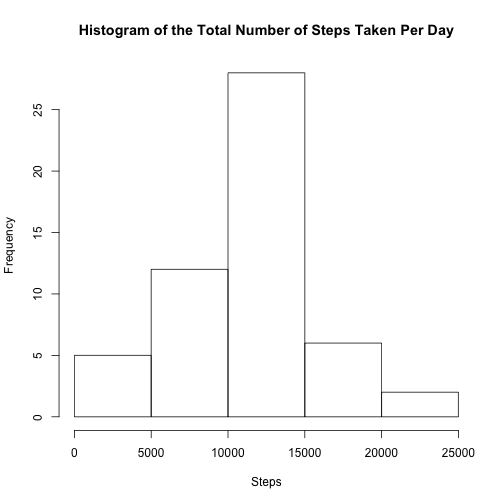
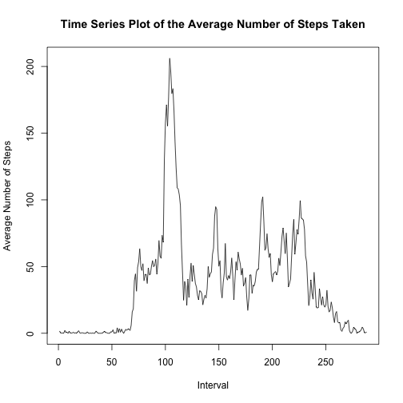
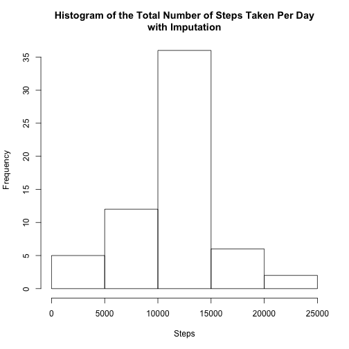
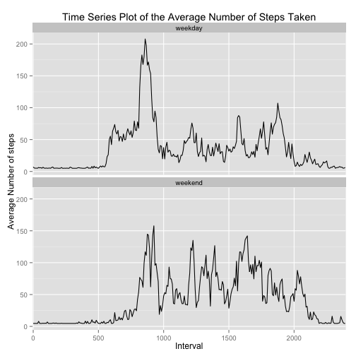

<<<<<<< HEAD
Reproducible Research: Peer Assessment 1
================================================================================
**Author: drktjones**

##Introduction
It is now possible to collect a large amount of data about personal movement 
using activity monitoring devices such as a Fitbit, Nike Fuelband, or Jawbone 
Up. These type of devices are part of the ???quantified self??? movement ??? a group 
of enthusiasts who take measurements about themselves regularly to improve 
their health, to find patterns in their behavior, or because they are tech 
geeks. But these data remain under-utilized both because the raw data are hard 
to obtain and there is a lack of statistical methods and software for processing
and interpreting the data.

This assignment makes use of data from a personal activity monitoring device. 
This device collects data at 5 minute intervals through out the day. The data 
consists of two months of data from an anonymous individual collected during the 
months of October and November, 2012 and include the number of steps taken in 5 
minute intervals each day.

##Set Programming Environment
This chunk is responsible for loading the necessary libraries and seting the global options to ```echo = TRUE``` so that the code is visible in the report. I have also included ```options(scipen = 2, digits = 2)``` to disable scientific notation when printing data. 

```r
library(knitr)
library(ggplot2)
opts_chunk$set(echo = TRUE)
options(scipen = 2, digits = 2)
```

##Load and Pre-process Data
The user should have already downloaded, unzipped, and stored the dataset in their working directory. The dataset is stored as a comma-separated-value format and contains three variables: *steps*, *date*, and *interval*. The data file can be downloaded [here](https://d396qusza40orc.cloudfront.net/repdata%2Fdata%2Factivity.zip).


```r
dat <- read.csv(file = "activity.csv", header = TRUE, 
                colClasses = c("numeric", "character", "numeric"))
dat$date <- as.Date(dat$dat, format = "%Y-%m-%d")
dat$interval <- factor(dat$interval)
```

## Assignment Questions

###*What is mean total number of steps taken per day?*
This chunk first calculates the total number of steps taken per day and plots a hisogram of this data.


```r
totalnum <- aggregate(steps ~ date, data = dat, FUN = sum)
hist(totalnum$steps, xlab = "Steps", ylab = "Frequency", 
     main = "Histogram of the Total Number of Steps Taken Per Day")
```

 

This chunk calculates and report the mean and median of the total number of steps taken per day.

```r
meanstep <- mean(totalnum$steps)
medianstep <- median(totalnum$steps)
```

The mean and median of the total number of steps taken per day is **10766.19** and **10765**, respectively. 

###*What is the average daily activity pattern?*

This chunk produces a time series plot of the 5-minute interval (x-axis) and the average number of steps taken, averaged across all days (y-axis). 


```r
avgsteps_int <- aggregate(steps ~ interval, data = dat, FUN = mean)
plot(steps~as.numeric(interval), type = "l", data = avgsteps_int, 
     xlab="Interval", 
     ylab="Average Number of Steps", 
     main="Time Series Plot of the Average Number of Steps Taken")
```

 

The 5-minute interval, on average across all the days in the dataset, that contains the maximum number of steps is given by the following code:


```r
avgsteps_int$interval[avgsteps_int$steps==max(avgsteps_int$steps)]
```

```
## [1] 835
## 288 Levels: 0 5 10 15 20 25 30 35 40 45 50 55 100 105 110 115 120 ... 2355
```

The maximum number of steps is in interval **835**

###*Imputing missing values*
There are a number of days/intervals where there are missing values. The presence of missing days may introduce bias into some calculations or summaries of the data. This chunk calculates and reports the total number of missing values in the dataset.


```r
sum(is.na(dat))
```

```
## [1] 2304
```

The total number of missing values in the dataset is **2304**

A new dataset is created that imputes missing steps with the overall mean.

```r
dat_imp <- dat
for (i in 1:length(dat_imp$steps)) {
        if (is.na(dat_imp$steps[i])) {
                dat_imp$steps[i] <- mean(dat_imp$steps, na.rm = TRUE)
        }
}
```

Let's check data. 


```r
rbind(head(cbind(dat, dat_imp)), 
        cbind(dat, dat_imp)[c(1:5, 688:692),],
        tail(cbind(dat, dat_imp)))
```

```
##       steps       date interval steps       date interval
## 1        NA 2012-10-01        0    37 2012-10-01        0
## 2        NA 2012-10-01        5    37 2012-10-01        5
## 3        NA 2012-10-01       10    37 2012-10-01       10
## 4        NA 2012-10-01       15    37 2012-10-01       15
## 5        NA 2012-10-01       20    37 2012-10-01       20
## 6        NA 2012-10-01       25    37 2012-10-01       25
## 11       NA 2012-10-01        0    37 2012-10-01        0
## 21       NA 2012-10-01        5    37 2012-10-01        5
## 31       NA 2012-10-01       10    37 2012-10-01       10
## 41       NA 2012-10-01       15    37 2012-10-01       15
## 51       NA 2012-10-01       20    37 2012-10-01       20
## 688      51 2012-10-03      915    51 2012-10-03      915
## 689     516 2012-10-03      920   516 2012-10-03      920
## 690     245 2012-10-03      925   245 2012-10-03      925
## 691       0 2012-10-03      930     0 2012-10-03      930
## 692     161 2012-10-03      935   161 2012-10-03      935
## 17563    NA 2012-11-30     2330    37 2012-11-30     2330
## 17564    NA 2012-11-30     2335    37 2012-11-30     2335
## 17565    NA 2012-11-30     2340    37 2012-11-30     2340
## 17566    NA 2012-11-30     2345    37 2012-11-30     2345
## 17567    NA 2012-11-30     2350    37 2012-11-30     2350
## 17568    NA 2012-11-30     2355    37 2012-11-30     2355
```

We see that the NA's were replaced by the overall mean of **37.38**.

Here is a histogram of the total number of steps taken each day for the new dataset with imputation.


```r
itotalnum <- aggregate(steps ~ date, data = dat_imp, FUN = sum)
hist(itotalnum$steps, xlab = "Steps", ylab = "Frequency", 
     main = "Histogram of the Total Number of Steps Taken Per Day\nwith Imputation")
```

 

This chunk calculates and report the mean and median of the total number of steps taken per day.


```r
imeanstep <- mean(itotalnum$steps)
imedianstep <- median(itotalnum$steps)
```

The mean and median of the total number of steps taken per day for the imputed dataset is **10766.19** and **10766.19**, respectively. Recall, the mean and median without imputation was **10766.19** and **10765**, respectively. Imputting data had no impact on the mean. However, the median does increase for the dataset with imputation.

###*Are there differences in activity patterns between weekdays and weekends?*

This chunk creates a new factor variable in the dataset with two levels ??? ???weekday??? and ???weekend??? indicating whether a given date is a weekday or weekend day.


```r
dat_imp$datetype <- factor(ifelse (weekdays(dat_imp$date)=="Saturday" | 
                        weekdays(dat_imp$date)=="Sunday", "weekend", "weekday"))
```

Here is a panel plot containing a time series plot of the 5-minute interval (x-axis) and the average number of steps taken, averaged across all weekday days or weekend days (y-axis). Using the following steps:

1. Create separate datasers that aggregate for each date type (i.e., weekday or weekend)
2. Combine data sets
3. Produce plot


```r
iMFavgsteps_int <- aggregate(steps ~ interval, 
                        data = subset(dat_imp, datetype == "weekday"), FUN = mean)
iSSavgsteps_int <- aggregate(steps ~ interval, 
                        data = subset(dat_imp, datetype == "weekend"), FUN = mean)
iavgsteps_int <- rbind(cbind(iMFavgsteps_int, datetype = "weekday"),
                        cbind(iSSavgsteps_int, datetype = "weekend"))

ggplot(iavgsteps_int, aes(x = interval, y = steps, group = 1)) + 
        geom_line() + 
        scale_x_discrete(breaks=seq(0, 2500, 500)) + 
        facet_wrap(~ datetype, nrow = 2) + 
        ylab("Average Number of steps") + 
        xlab("Interval") +
        ggtitle("Time Series Plot of the Average Number of Steps Taken")
```

 

There does appear to be a difference in the average number of steps taken for weekdays and weekends. For example, the maximum number of steps taken for weekdays is at interval **835 (mean steps = 207.87)** and for weekends at interval **915 (mean steps = 157.8)**.


=======
---
title: "Reproducible Research: Peer Assessment 1"
output: 
  html_document:
    keep_md: true
---


## Loading and preprocessing the data


## What is mean total number of steps taken per day?


## What is the average daily activity pattern?


## Imputing missing values


## Are there differences in activity patterns between weekdays and weekends?
>>>>>>> 80edf39c3bb508fee88e3394542f967dd3fd3270
